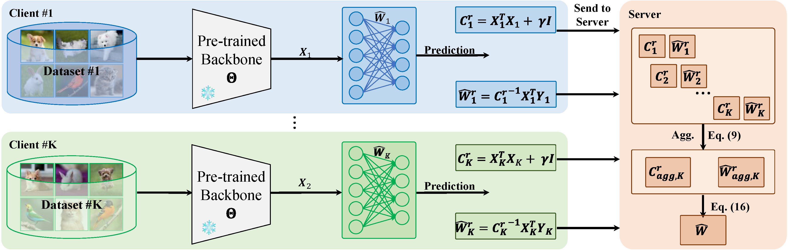

<div align="center">
  
# 【CVPR' 2025】AFL: A Single-Round Analytic Approach for Federated Learing with Pre-trained Models
### Run He, Kai Tong, Di Fang, Han Sun, Ziqian Zeng, Haoran Li, Tianyi Chen, Huiping Zhuang* 
  
</div>

## Introduction
The official implementation for [AFL: A Single-Round Analytic Approach for Federated Learing with Pre-trained Models](https://openreview.net/forum?id=Dz4P61OqGw) in PyTorch.

## Abstract
n this paper, we introduce analytic federated learning (AFL), a new training paradigm that brings analytical (i.e., closed-form) solutions to the federated learning (FL) with pre-trained models. Our AFL draws inspiration from analytic learning---a gradient-free technique that trains neural networks with analytical solutions in one epoch. In the local client training stage, the AFL facilitates a one-epoch training, eliminating the necessity for multi-epoch updates. In the aggregation stage, we derive an absolute aggregation (AA) law. This AA law allows a single-round aggregation, reducing heavy communication overhead and achieving fast convergence by removing the need for multiple aggregation rounds. More importantly, the AFL exhibits a property that invariance to data partitioning, meaning that regardless of how the full dataset is distributed among clients, the aggregated result remains identical. This could spawn various potentials, such as data heterogeneity invariance and client-number invariance. We conduct experiments across various FL settings including extremely non-IID ones, and scenarios with a large number of clients (e.g., $ \ge 1000$ ). In all these settings, our AFL constantly performs competitively while existing FL techniques encounter various obstacles.

## Overview

<div align="center">

</div>

## Quick Start

### Setup code environment

See the details in [requirements.yaml](requirements.yaml)

A suitable [conda](https://conda.io/) environment named `afl` can be created and activated with:
```Bash
   conda env create -f environment.yaml
   conda activate afl
```

### Datasets

We provide the implementation on three benchmark datasets reported in the paper, i.e., CIFAR-10, CIFAR-100, and Tiny-ImageNet. 

### Run

You can simply run the code with the 'run.sh' on CIFAR-10.

```Bash
   sh run.sh
```
You can also change the arguments for different experimental setting. 

Part of arguments are listed followed.
- `dataset`: The dataset for the experiments. Supported datasets are: [cifar10, cifar100, tinyimagenet]
- `arch`: Model type of the experiment, ResNet-18 by default.
- `num_clients`: Number of total clients. 
- `num_classes`: Number of total classes.
- `niid`: Choose to be non-iid data. 
- `partition`: Partition types of the data, including Dirichlet Allocation (`dir`) and Sharding (`pat`). Supported types: [dir, pat]
- `alpha`: Parameter to control the data heterogeneity in 'dir' setting. 
- `shred`: Parameter to control the data heterogeneity in 'pat' setting. 
- `rg`: Regularization factor $\gamma$.
- `clean_reg`: Choose to clean the regularization.


## Dummy Data Validation

Please refer to the [Dummy_validation.ipynb](Dummy_validation.ipynb) to find the detailed implementation.

## Dual Branch

We have a dual branch at "[Analytic Continual Learning.](https://github.com/ZHUANGHP/Analytic-continual-learning)" 

## Acknowledgment

The implementation of data partition in this repository is partly adopted from that in [PFLlib](https://github.com/TsingZ0/PFLlib). We sincerely appreciate for their contributions.

## Cite Our Paper
If you find this paper useful, please consider staring this repo and citing our paper:
```bib
@Inproceedings{AFL_He_CVPR2025,
      title={{AFL}: A Single-Round Analytic Approach for Federated Learing with Pre-trained Models}, 
      author={Run He and Kai Tong and Di Fang and Han Sun and Ziqian Zeng and Haoran Li and Tianyi Chen and Huiping Zhuang},
      year={2025},
      booktitle = {Proceedings of the IEEE/CVF Conference on Computer Vision and Pattern Recognition (CVPR)}}
```
